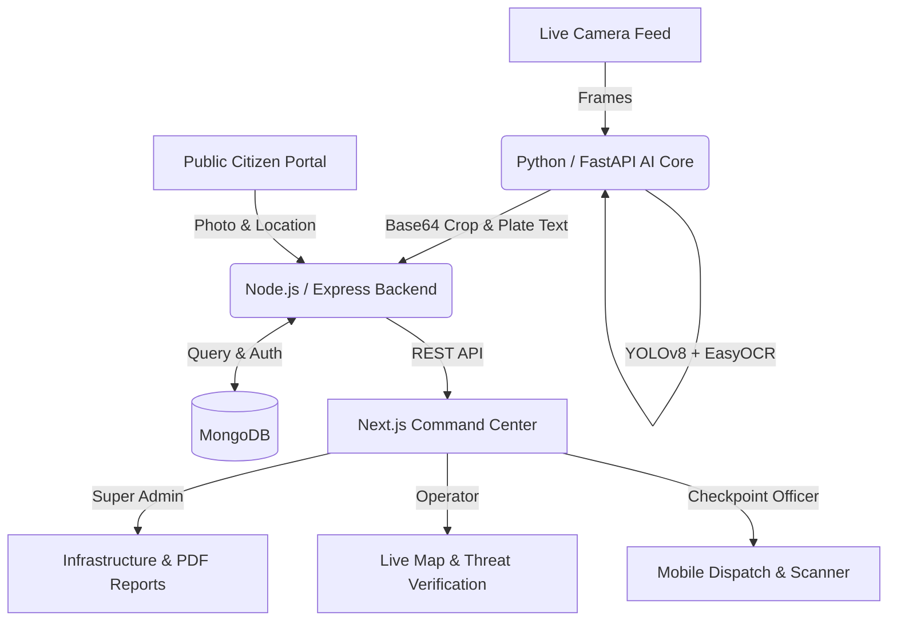

# 🏙️ Safe City AI: Automatic License Plate Recognition System


A full-stack, microservices-based Automatic License Plate Recognition (ALPR) platform designed for modern law enforcement and city command centers. 

This system uses cutting-edge Computer Vision to detect and read license plates from live camera feeds in real-time, cross-references them against a central database, and instantly dispatches alerts for stolen or unregistered vehicles to field officers.

---
SUPER ADMIN:


📸 Super Admin Command Center: Built with secure Role-Based Access Control (RBAC) using JWTs. Super Admins can manage the entire surveillance infrastructure, generate automated PDF Security Briefings, and assign field officers to physical checkpoints.


📸 Live Threat Triage: AI detections are instantly fed to this central dashboard. Features a custom Anti-Spam/Debounce algorithm in the Node.js backend to prevent duplicate alerts if a flagged car is sitting at a red light. Operators can review the AI's confidence, instantly correct OCR typos, and dispatch the alert to field officers.


📸 Central Vehicle Registry: A full CRUD interface for managing the city's registered vehicles. Admins can update legal statuses (e.g., flagging a car as 'Stolen'), which instantly updates the cross-reference matching logic used by the real-time AI pipeline.


📸 Tactical Checkpoint Management: Admins can define physical security checkpoints using interactive map coordinates. Includes a dynamic assignment system that automatically dispatches simulated SMS alerts to Checkpoint Officers when they are deployed to a new location.


📸 Surveillance Grid Setup: Interface for registering new IP/CCTV cameras into the network. Cameras are tied to specific GPS coordinates, allowing the Node.js backend to accurately plot AI threat detections on the Live City Map.


📸 Staff & Access Control: Comprehensive User management system built on JWT (JSON Web Tokens) and RBAC (Role-Based Access Control). Admins can securely provision accounts for Command Center Operators and Field Officers with strictly segregated database permissions.


OPERATOR:


📸 Command Center Triage (Operator): Real-time feed of AI threat detections. Features a custom Anti-Spam/Debounce algorithm to prevent duplicate alerts. Operators can review the AI's snapshot, instantly correct OCR typos, and dispatch verified threats directly to field units.


OFFICER:


📸 Mobile Dispatch Queue (Field Officer): A mobile-optimized interface for officers stationed at physical checkpoints. Officers receive instantly dispatched threats from the Command Center, complete with suspect vehicle photos, registry details, and status resolution controls (e.g., marking a threat as 'Resolved').


📸 Tactical Plate Scanner (Field Officer): A real-time manual fallback tool. Allows field officers to type and query a suspicious license plate against the central Node.js backend registry on the go, instantly retrieving owner details and generating a manual threat alert if the vehicle is flagged.


## ✨ Key Features


- **🧠 Real-Time AI Pipeline:** Utilizes **YOLOv8** for rapid vehicle detection and **EasyOCR** for extracting license plate text from live webcam or RTSP streams.
- **🗺️ Live Command Center Map:** Interactive Leaflet.js map tracking all active cameras, checkpoints, and plotting live threats in real-time.
- **🛡️ Anti-Spam / Debounce Logic:** Smart backend algorithms prevent the system from flooding operators with duplicate alerts when a flagged car sits at a red light.
- **📱 Checkpoint Officer App:** Mobile-friendly view for field officers to receive dispatches and manually scan plates.
- **📸 Public Citizen Portal:** A public-facing web app allowing citizens to upload photos and drop map pins to report suspicious vehicles directly to the command center.
- **📊 PDF Security Briefings:** Automated generation of daily statistical reports and incident logs using jsPDF.

---

## 🏗️ System Architecture

The project is broken down into three decoupled microservices to ensure scalability:



---

## 💻 Tech Stack

### AI Core (Computer Vision)
- **Python 3**
- **YOLOv8 (Ultralytics):** Vehicle bounding box detection
- **EasyOCR:** Optical Character Recognition
- **FastAPI:** Exposing the AI as a local microservice
- **OpenCV:** Frame extraction and image processing

### Backend (API & Database)
- **Node.js & Express.js**
- **MongoDB & Mongoose:** Data persistence and geospatial queries
- **JSON Web Tokens (JWT):** Role-based access control (Admin, Operator, Officer)

### Frontend (UI/UX)
- **Next.js & React**
- **Tailwind CSS:** Responsive, dark-mode command center styling
- **Leaflet.js & React-Leaflet:** Interactive city mapping
- **jsPDF & AutoTable:** Client-side PDF generation

---

## 🚀 Getting Started

### Prerequisites
- Node.js (v18+)
- Python (3.9+)
- MongoDB running locally or via MongoDB Atlas

### 1. Database Setup & Seeding
```bash
cd backend
npm install
# Rename .env.example to .env and add your MONGO_URI
node seed.js  # Seeds admin users, cameras, and mock vehicle registry
node server.js # Starts the backend on port 5000
```

### 2. AI Core Setup
```bash
cd ai-core
python -m venv venv
# Activate venv (Windows: .\venv\Scripts\activate | Mac/Linux: source venv/bin/activate)
pip install -r requirements.txt
uvicorn main:app --reload # Starts FastAPI on port 8000
```
*In a separate terminal, start the camera streamer:*
```bash
python rtsp_stream.py 0 # 0 for laptop webcam, or provide an RTSP URL
```

### 3. Frontend Setup
```bash
cd safecity-frontend
npm install
# Create .env.local with NEXT_PUBLIC_API_URL=http://localhost:5000/api
npm run dev # Starts the dashboard on port 3000
```

---

## 👤 Default Test Credentials
- **Super Admin:** `admin@safecity.pk` | `Admin@123`
- **Operator:** `operator1@safecity.pk` | `Operator@123`
- **Checkpoint Officer:** `officer1@safecity.pk` | `Officer@123`

---
*Built as a portfolio project to demonstrate microservices architecture, full-stack web development, and applied computer vision.*
