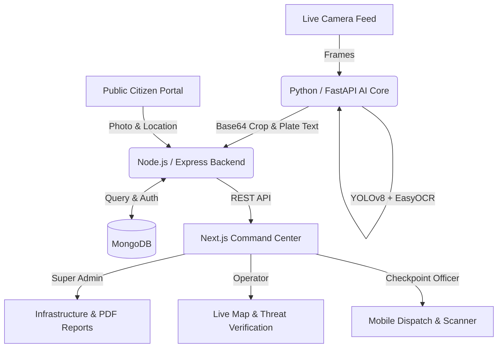

# 🏙️ Safe City AI: Automatic License Plate Recognition System


A full-stack, microservices-based Automatic License Plate Recognition (ALPR) platform designed for modern law enforcement and city command centers. 

This system uses cutting-edge Computer Vision to detect and read license plates from live camera feeds in real-time, cross-references them against a central database, and instantly dispatches alerts for stolen or unregistered vehicles to field officers.

---

## ✨ Key Features

- **🧠 Real-Time AI Pipeline:** Utilizes **YOLOv8** for rapid vehicle detection and **EasyOCR** for extracting license plate text from live webcam or RTSP streams.
- **🗺️ Live Command Center Map:** Interactive Leaflet.js map tracking all active cameras, checkpoints, and plotting live threats in real-time.
- **🛡️ Anti-Spam / Debounce Logic:** Smart backend algorithms prevent the system from flooding operators with duplicate alerts when a flagged car sits at a red light.
- **📱 Checkpoint Officer App:** Mobile-friendly view for field officers to receive dispatches and manually scan plates.
- **📸 Public Citizen Portal:** A public-facing web app allowing citizens to upload photos and drop map pins to report suspicious vehicles directly to the command center.
- **📊 PDF Security Briefings:** Automated generation of daily statistical reports and incident logs using jsPDF.

---

## 🏗️ System Architecture

The project is broken down into three decoupled microservices to ensure scalability:



---

## 💻 Tech Stack

### AI Core (Computer Vision)
- **Python 3**
- **YOLOv8 (Ultralytics):** Vehicle bounding box detection
- **EasyOCR:** Optical Character Recognition
- **FastAPI:** Exposing the AI as a local microservice
- **OpenCV:** Frame extraction and image processing

### Backend (API & Database)
- **Node.js & Express.js**
- **MongoDB & Mongoose:** Data persistence and geospatial queries
- **JSON Web Tokens (JWT):** Role-based access control (Admin, Operator, Officer)

### Frontend (UI/UX)
- **Next.js & React**
- **Tailwind CSS:** Responsive, dark-mode command center styling
- **Leaflet.js & React-Leaflet:** Interactive city mapping
- **jsPDF & AutoTable:** Client-side PDF generation

---

## 🚀 Getting Started

### Prerequisites
- Node.js (v18+)
- Python (3.9+)
- MongoDB running locally or via MongoDB Atlas

### 1. Database Setup & Seeding
```bash
cd backend
npm install
# Rename .env.example to .env and add your MONGO_URI
node seed.js  # Seeds admin users, cameras, and mock vehicle registry
node server.js # Starts the backend on port 5000
```

### 2. AI Core Setup
```bash
cd ai-core
python -m venv venv
# Activate venv (Windows: .\venv\Scripts\activate | Mac/Linux: source venv/bin/activate)
pip install -r requirements.txt
uvicorn main:app --reload # Starts FastAPI on port 8000
```
*In a separate terminal, start the camera streamer:*
```bash
python rtsp_stream.py 0 # 0 for laptop webcam, or provide an RTSP URL
```

### 3. Frontend Setup
```bash
cd safecity-frontend
npm install
# Create .env.local with NEXT_PUBLIC_API_URL=http://localhost:5000/api
npm run dev # Starts the dashboard on port 3000
```

---

## 👤 Default Test Credentials
- **Super Admin:** `admin@safecity.pk` | `Admin@123`
- **Operator:** `operator1@safecity.pk` | `Operator@123`
- **Checkpoint Officer:** `officer1@safecity.pk` | `Officer@123`

---
*Built as a portfolio project to demonstrate microservices architecture, full-stack web development, and applied computer vision.*
